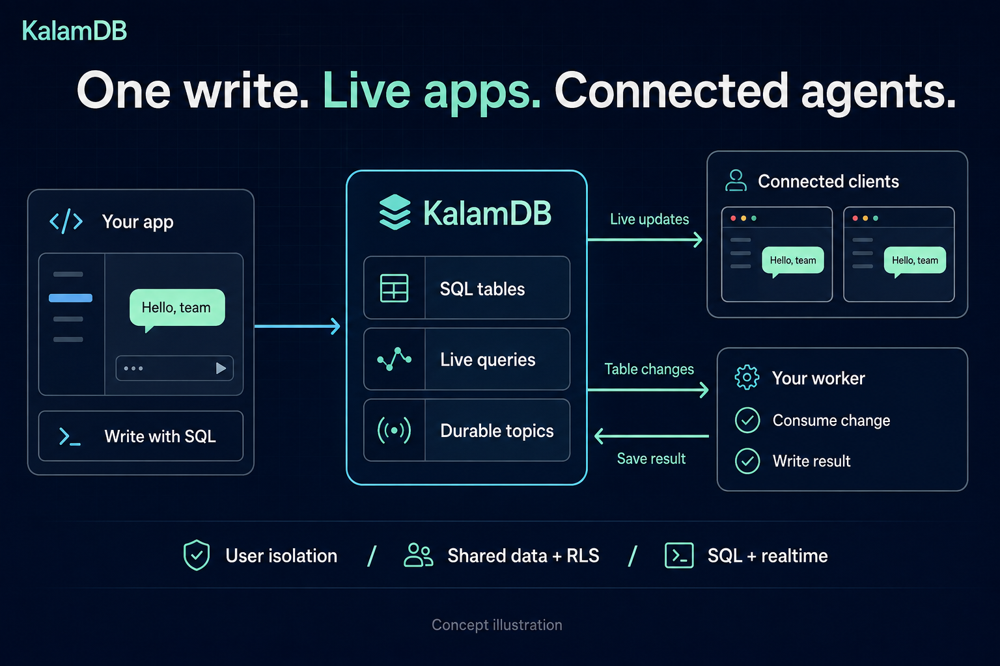
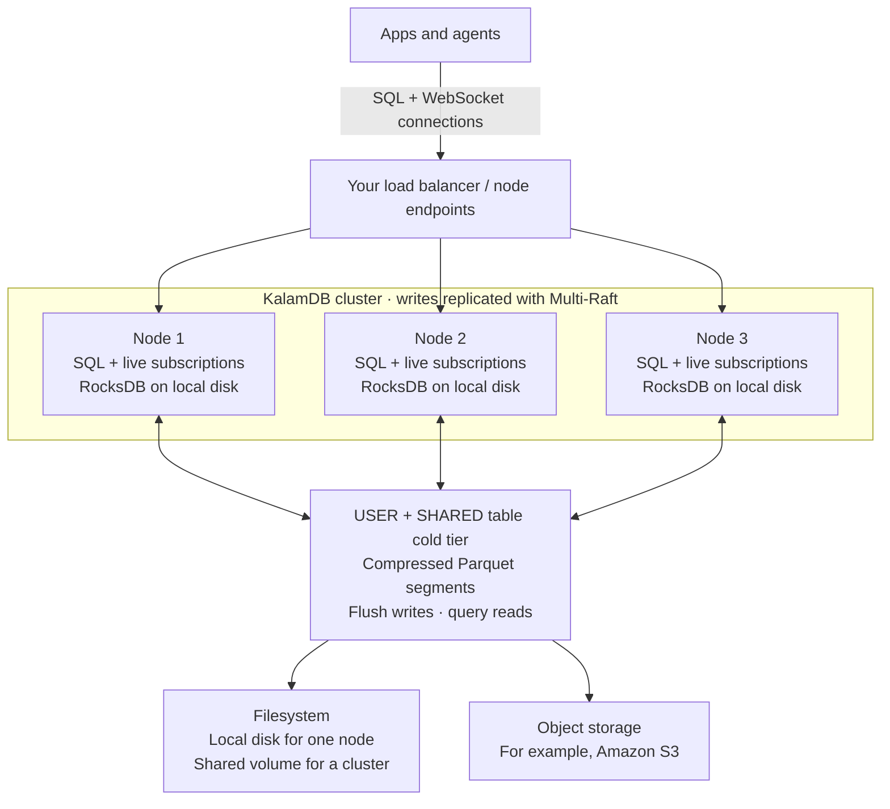

### Build realtime apps with SQL. Connect agents to the same data.

KalamDB brings SQL tables, live subscriptions, and durable topics together in one open-source backend. Build collaborative apps with live updates, keep personal data isolated by user, and let workers and AI agents react to changes.

   

[Get started](#get-started) · [How it scales](#grow-your-app-and-your-data) · [Examples](#build-something) · [Documentation](https://kalamdb.org/docs)

## Get started

Start with a working React chat app: two browser tabs, live messages, and a worker that writes a reply. You'll need a current Node.js LTS with npm. The demo uses a simulated agent response, so no external AI key is required.

```bash
npm install -g @kalamdb/cli

mkdir my-app && cd my-app
kalam init --yes --template chat-with-ai --languages typescript --package-manager npm
kalam dev
```

**Open the app URL printed in your terminal in two browser tabs.** Send a message such as `latency spike after deploy`. Watch it appear in both tabs, followed by live worker progress and a saved reply.

`kalam init` creates the app, schema, migrations, and project configuration. `kalam dev` starts or reuses a local database, applies the schema, generates types, and runs the app and worker. Keep it running while you develop.

Prefer a minimal starter? Run `kalam init` in an empty folder and choose a template. See the [quick-start guide](docs/getting-started/quick-start.md) for setup details.

## One write connects your app and your agents



In the chat starter, sending a message inserts a row. KalamDB sends the change to subscribed clients and routes it to a topic. Your worker consumes the change and saves a reply, which appears through the same live subscriptions.

After joining a room, the app's write looks like this:

```ts
await db.insert(chatMessages).values({
  room: ROOM,
  role: 'user',
  author: CHAT_USERNAME,
  sender_username: CHAT_USERNAME,
  content: 'Hello, team!',
});
```

The starter uses generated TypeScript tables with the KalamDB ORM. Its SQL schema connects new messages to the worker's topic:

```sql
CREATE TOPIC IF NOT EXISTS chat_demo.ai_inbox;
ALTER TOPIC chat_demo.ai_inbox
  ADD SOURCE chat_demo.messages ON INSERT;
```

Follow the complete [schema](examples/chat-with-ai/kalam/schema.sql), [app](examples/chat-with-ai/src/App.tsx), and [worker](examples/chat-with-ai/src/agent.ts) to see how they fit together. Your worker runs your application or model logic; KalamDB handles data, subscriptions, and topic delivery.

## What you can build on

| Your app needs | KalamDB gives you |
| --- | --- |
| Live chat, activity feeds, and collaborative screens | **Live queries:** subscribe to supported SQL queries over WebSocket. |
| Personal notes, conversations, and agent memory | **USER tables:** the same query returns the authenticated user's own rows. |
| Shared rooms, teams, and projects | **SHARED tables + RLS:** SQL policies control access to collaborative data. |
| Typing indicators and agent progress | **STREAM tables:** temporary events with TTL-based expiry. |
| Background jobs and AI workers | **Durable topics:** table changes, consumer groups, acknowledgements, and retries. |
| A short development loop | **`kalam dev`:** schema changes, migrations, generated types, and app processes together. |
| A growing dataset and more connected clients | **Tiered storage and clusters:** Parquet on disk or object storage, with replicated nodes serving clients. |

USER tables scope both hot keys and cold segments by user. SHARED tables use explicit row-level policies on reads, writes, live events, and file access; ordinary user and service roles are denied without an applicable policy. See the [SQL reference](docs/reference/sql.md) for table types and policies.

## Grow your app and your data

Start with one node and local disk. As your application grows, distribute client connections across cluster nodes and use object storage for your growing Parquet dataset.



**More connected clients.** Each node serves its own WebSocket subscriptions after applying replicated writes locally. Clients can connect to any node; writes are forwarded to the appropriate Raft-group leader. User data is routed into user shards, and Multi-Raft coordinates replication and failover.

**More stored data.** Recent writes live in RocksDB on each node's local disk. USER and SHARED tables flush into compressed Parquet segments on the configured filesystem or object store. Use a shared cold-storage location accessible to every node in a cluster; the local cluster demo uses a shared volume.

**One SQL view across both tiers.** DataFusion and Arrow query hot rows and cold Parquet together, resolving row versions before returning results. Your app keeps querying the same tables as data moves into Parquet. STREAM tables stay in the hot tier and expire through TTL.

Nodes provide connection-serving capacity and replication; cold storage provides room for the Parquet dataset. Capacity depends on your workload and deployment. See [storage and query architecture](docs/architecture/hot-cold-storage-unification.md), [storage configuration](docs/reference/sql.md#create-storage), and [cluster behavior and current limits](docs/architecture/raft-replication.md).

### Try a local 3-node cluster

With Docker Compose installed:

```bash
git clone https://github.com/kalamdb/KalamDB.git
cd KalamDB
docker compose -f docker/run/cluster/docker-compose.yml up -d
```

The demo exposes nodes at `http://localhost:8081`, `http://localhost:8082`, and `http://localhost:8083`. See the [Compose configuration](docker/run/cluster/docker-compose.yml) for volumes and local demo settings.

## Build something

- [Collaborative chat with an agent](examples/chat-with-ai/README.md) — shared rooms, policies, live messages, and a topic worker.
- [Personal AI assistant](examples/react-ai-chat/README.md) — USER tables, streamed activity, tool calls, and approvals.
- [Summarizer worker](examples/summarizer-agent/README.md) — consume a change and write an enriched result back.
- SDKs: [TypeScript](link/sdks/typescript/client/) · [React](link/sdks/typescript/react/) · [ORM](link/sdks/typescript/orm/) · [Dart / Flutter](link/sdks/dart/link/) · [Rust](link/sdks/rust/).
- Go deeper: [Documentation](https://kalamdb.org/docs) · [CLI workflow](docs/getting-started/cli.md) · [SQL reference](docs/reference/sql.md) · [Contribute](docs/development/development-setup.md).

KalamDB is under active development. Check [release notes](https://github.com/kalamdb/KalamDB/releases) for current status and compatibility changes.

Apache-2.0 licensed. See [LICENSE.txt](LICENSE.txt).
