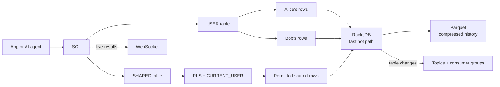

### The fast, realtime SQL backend for apps and AI agents.

One database for user-owned data, shared data with RLS, live queries, durable agent queues, and multi-node clusters.


KalamDB gives your frontend, backend, and agents the same SQL data plane. Reads and writes use SQL over HTTP; live results arrive over WebSocket; table changes can feed durable topics and consumer groups. No custom CRUD API or separate realtime and queue stack required.

## Start a project

```bash
npm install -g @kalamdb/cli

mkdir my-app && cd my-app
kalam init
kalam dev
```

`kalam init` scaffolds your app, `schema.sql`, migrations, configuration, and generated types. `kalam dev` starts or reuses a local KalamDB, applies schema changes, regenerates types, watches your project, and runs your app—all in one command.

## Built for the whole app lifecycle


|      | Capability              | What it gives you                                                                 |
| ---- | ----------------------- | --------------------------------------------------------------------------------- |
| ⚡    | `kalam dev`             | Database, migrations, generated types, schema watch, and app process together.    |
| 👤   | **USER tables**         | Rows are automatically isolated by the authenticated user.                        |
| 👥   | **SHARED tables + RLS** | Collaborative data protected by SQL policies; default-deny without one.           |
| 🔥❄️ | **Tiered storage**      | RocksDB hot path with compressed Parquet cold storage on local or object storage. |
| 🔴   | **Realtime**            | Subscribe to live SQL results over one shared WebSocket connection.               |
| 🤖   | **Pub/Sub for agents**  | Route table changes into topics with durable consumer groups and retries.         |
| 🌐   | **Cluster**             | Multi-Raft replication, sharded user data, follower forwarding, and failover.     |


## Data stays close to its user




USER-table keys and cold segments are scoped per user, so the same query naturally returns Alice's rows to Alice and Bob's rows to Bob. SHARED tables keep one collaborative dataset and enforce row-level policies on reads, writes, live events, and file access.

KalamDB keeps recent writes in indexed RocksDB, flushes history to compressed Parquet on local or object storage, and queries both through DataFusion and Arrow. That means a fast operational hot path without giving up efficient history and analytics.

## One schema, three superpowers

```sql
CREATE NAMESPACE app;

-- Private by default: KalamDB owns the user boundary.
CREATE USER TABLE app.notes (
  id TEXT PRIMARY KEY DEFAULT ULID(),
  body TEXT NOT NULL,
  created_at TIMESTAMP DEFAULT NOW()
);

-- Shared data: access is explicit and policy-driven.
CREATE SHARED TABLE app.tasks (
  id TEXT PRIMARY KEY DEFAULT ULID(),
  owner_id TEXT NOT NULL,
  title TEXT NOT NULL,
  done BOOLEAN DEFAULT false
);

CREATE POLICY task_owner ON app.tasks
  FOR ALL TO user
  USING (owner_id = CURRENT_USER)
  WITH CHECK (owner_id = CURRENT_USER);

-- Every task change can wake a durable group of AI workers.
CREATE TOPIC app.task_events PARTITIONS 4;
ALTER TOPIC app.task_events
  ADD SOURCE app.tasks ON INSERT WITH (payload = 'full');
```

Watch tasks update live:

```bash
kalam --subscribe "SELECT * FROM app.tasks"
```

Consume work across an agent group:

```sql
CONSUME FROM app.task_events
  GROUP 'planner-agents' FROM EARLIEST LIMIT 20;
```


## From laptop to a 3-node cluster

Local development stays one command. This local cluster demo starts three replicated nodes; clients can connect to any node and KalamDB routes writes to the correct Multi-Raft leader.

```bash
git clone https://github.com/kalamdb/KalamDB.git
cd KalamDB
docker compose -f docker/run/cluster/docker-compose.yml up -d
```


## Explore

- [Documentation](https://kalamdb.org/docs)
- [CLI and project workflow](docs/getting-started/cli.md)
- [SQL reference](docs/reference/sql.md)
- [Chat with AI example](examples/chat-with-ai/README.md)
- [Summarizer agent example](examples/summarizer-agent/README.md)
- SDKs: [TypeScript](link/sdks/typescript/client/) · [Dart / Flutter](link/sdks/dart/link/) · [Rust](link/sdks/rust/)

Apache-2.0 licensed. See [LICENSE.txt](LICENSE.txt).