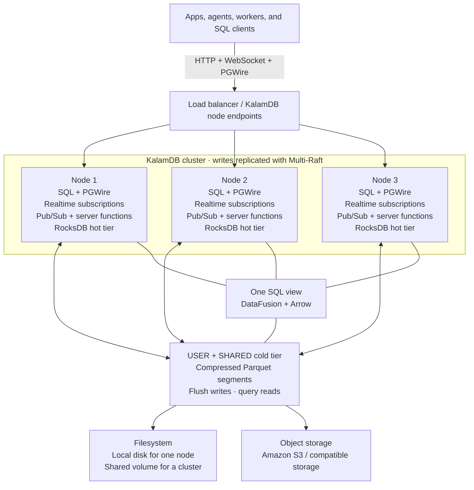

### One SQL schema. Your whole realtime backend.

KalamDB is an open-source, **SQL-first backend** that combines database tables, realtime subscriptions, durable pub/sub, and server functions in one system. It speaks the **PostgreSQL wire protocol (PGWire)**, so existing PostgreSQL tools and drivers can connect directly.

Define your backend once in SQL. KalamDB uses that schema for storage, permissions, realtime events, procedure contracts, backend-managed schema migrations, and generated application types.

   

[Get started](#get-started) · [Schema first](#one-schema-for-your-whole-backend) · [Realtime + pubsub](#one-write-connects-your-app-workers-and-agents) · [PostgreSQL](#connect-with-postgresql-tools) · [How it scales](#grow-your-app-and-your-data) · [Documentation](https://kalamdb.org/docs)

## Get started

Start with a working React chat app: two browser tabs, live messages, durable worker events, and a server procedure that writes a reply. You'll need a current Node.js LTS with npm. The demo uses a simulated copilot response, so no external AI key is required.

```bash
npm install -g @kalamdb/cli

mkdir my-app && cd my-app
kalam init --yes --template chat-with-ai --languages typescript --package-manager npm
kalam dev
```

**Open the app URL printed in your terminal in two browser tabs.** Send a message such as `latency spike after deploy`. Watch it appear in both tabs, followed by live worker progress and a saved reply.

`kalam init` creates the app, SQL schema, and project configuration. `kalam dev` starts or reuses a local KalamDB server, applies backend schema migrations, regenerates application contracts, activates procedures, and runs the app.

The SQL schema stays the source of truth while KalamDB keeps the backend and generated code in sync.

Prefer a minimal starter? Run `kalam init` in an empty folder and choose a template. See the [quick-start guide](docs/getting-started/quick-start.md) for setup details.

## One schema for your whole backend

KalamDB is **schema first**. Tables, types, enums, procedures, topics, and access rules live together in SQL instead of being redefined across your database, API, workers, and application code.

A messaging backend can describe most of its contract in one `schema.sql`:

```sql
CREATE TYPE chat.message_status AS ENUM ('sent', 'delivered', 'read');

CREATE TYPE chat.send_message_input AS (
    room_id TEXT,
    content TEXT
);

CREATE TYPE chat.send_message_result AS (
    id BIGINT,
    status chat.message_status
);

CREATE SHARED TABLE chat.messages (
    id BIGINT PRIMARY KEY DEFAULT SNOWFLAKE_ID(),
    room_id TEXT NOT NULL,
    content TEXT NOT NULL,
    status chat.message_status NOT NULL DEFAULT 'sent',
    created_at TIMESTAMPTZ NOT NULL DEFAULT NOW()
);

CREATE PROCEDURE chat.send_message(input chat.send_message_input)
RETURNS chat.send_message_result;

CREATE TOPIC chat.new_messages;
ALTER TOPIC chat.new_messages ADD SOURCE chat.messages ON INSERT;
```

That same schema describes the stored data, procedure input/output contracts, event source, and generated application types.

```text
                         schema.sql
                             │
          ┌──────────────────┼──────────────────┐
          │                  │                  │
          ▼                  ▼                  ▼
     SQL tables         Types / enums      Procedures
          │                  │                  │
          ├──────────────┬───┴───────┬─────────┤
          │              │           │         │
          ▼              ▼           ▼         ▼
       PGWire         Realtime     Pub/Sub   Server functions
   PostgreSQL tools   WebSocket     Topics    V8 runtime
          │              │           │         │
          └──────────────┴─────┬─────┴─────────┘
                               ▼
                       Generated contracts
                     TypeScript · Dart/Flutter
```

Today the CLI can generate TypeScript and Dart/Flutter targets from the same SQL schema. The contract remains language-independent, so additional generators can use the same definitions without introducing another API schema.

Schema changes follow the same model: change SQL, and KalamDB handles the corresponding backend migration and contract regeneration through the development/deployment workflow.

## One write connects your app, workers, and agents


A single write can serve several parts of your application at once:

- **SQL / PGWire** clients read and write the same tables.
- **Realtime subscriptions** push matching changes to connected apps over WebSocket.
- **Durable topics** let background workers and AI agents consume changes with acknowledgements and retries.
- **Server functions** run trusted TypeScript logic close to the data and can query tables, write rows, publish events, and call other procedures.

In the chat starter, sending a message calls the generated procedure client:

```ts
await api.chatDemo.sendMessage({
  target: 'room',
  target_id: ROOM,
  content: 'Hello, team!',
});
```

The message appears immediately for subscribed clients and can also be routed into a durable topic for a worker or AI agent. When that worker writes its result back, the UI receives the update through the same realtime subscription path.

Follow the complete [schema](examples/chat-with-ai/kalam/schema.sql), [app](examples/chat-with-ai/src/App.tsx), and [procedures](examples/chat-with-ai/functions/src/chat_demo) to see the full flow.

## What you can build on

| Your app needs | KalamDB gives you |
| --- | --- |
| One source of truth for backend contracts | **Schema-first SQL:** tables, types, enums, procedures, topics, and policies live together. |
| Existing PostgreSQL tools and drivers | **PGWire:** connect `psql`, DBeaver, PostgreSQL drivers, prepared queries, transactions, and `CALL`. |
| Live chat, feeds, dashboards, and collaborative screens | **Realtime queries:** subscribe to supported SQL queries over WebSocket. |
| Background jobs and AI workers | **Durable pub/sub:** table-change sources, consumer groups, acknowledgements, and retries. |
| Backend business logic | **Server functions:** sandboxed TypeScript procedures running inside KalamDB. |
| Typed application contracts | **Code generation:** generate TypeScript and Dart/Flutter types from the same SQL schema. |
| Schema evolution | **Backend-managed migrations:** schema changes are applied through the KalamDB development/deployment workflow. |
| Personal notes, conversations, and agent memory | **USER tables:** the same query returns the authenticated user's own rows. |
| Shared rooms, teams, and projects | **SHARED tables + RLS:** SQL policies control access to collaborative data. |
| Typing indicators and agent progress | **STREAM tables:** temporary events with TTL-based expiry. |
| Growing datasets | **Tiered storage:** recent data in RocksDB, older USER/SHARED data in compressed Parquet. |
| More connections and availability | **Multi-Raft clusters:** replicated nodes serve clients and coordinate failover. |

USER tables scope both hot keys and cold segments by user. SHARED tables use explicit row-level policies on reads, writes, live events, and file access; ordinary user and service roles are denied without an applicable policy. See the [SQL reference](docs/reference/sql.md) for table types and policies.

## Server functions live next to your data

Server functions execute inside KalamDB in a sandboxed V8 runtime. Their contracts are declared in the same SQL schema as your tables and types, so you do not need a separate request/response definition for the backend function.

`kalam schema gen` generates the typed implementation bindings, and `kalam deploy --env dev` builds the function module, applies schema migrations, and activates the new revision on the backend.

The same procedure can be called through a generated client, HTTP, or SQL `CALL` over PGWire. Procedures run as the caller by default; grant `EXECUTE` only to roles that should use them.

See the [procedure reference](docs/reference/sql.md#create-procedure) and [deployment workflow](docs/getting-started/cli.md#deploy-with-migration-guardrails) for access control, environments, revisions, and rollback.

## Connect with PostgreSQL tools

KalamDB speaks the PostgreSQL wire protocol, so you can use `psql`, DBeaver, and PostgreSQL drivers alongside KalamDB SDKs and realtime APIs.

Enable PGWire in your server configuration:

```toml
[postgres_wire]
enabled = true
host = "127.0.0.1"
port = 5432
```

For a local server, connect with your KalamDB credentials:

```bash
psql -h 127.0.0.1 -p 5432 -U root -d kalam -W
```

PGWire supports simple and prepared queries, transactions, and SQL `CALL`. Queries use KalamDB's SQL engine and permissions. PostgreSQL protocol support does not imply full PostgreSQL SQL or extension compatibility. See [client compatibility](docs/architecture/pg-catalog-shims.md) for supported catalog features and current limits.

## Grow your app and your data

Start with one node and local disk. As your application grows, add nodes for more connection-serving capacity and replication, while moving older table data into compressed Parquet on filesystem or object storage.



**More connected clients.** Each node serves its own HTTP, PGWire, WebSocket subscriptions, topics, and function requests after applying replicated writes locally. Clients can connect to any node; writes are forwarded to the appropriate Raft-group leader. User data is routed into user shards, and Multi-Raft coordinates replication and failover.

**Hot data stays fast.** Recent writes live in RocksDB on each node's local disk so active application data remains close to the compute serving queries and realtime subscriptions.

**Older data moves to Parquet.** USER and SHARED tables flush into compressed Parquet segments on the configured filesystem or object store. Use a shared cold-storage location accessible to every node in a cluster; the local cluster demo uses a shared volume.

**One SQL view across both tiers.** DataFusion and Arrow query hot RocksDB rows and cold Parquet together, resolving row versions before returning results. Your application keeps querying the same tables as data moves between tiers. STREAM tables remain in the hot tier and expire through TTL.

Nodes provide connection-serving capacity and replication; cold storage provides room for the growing Parquet dataset. Capacity depends on your workload and deployment. See [storage and query architecture](docs/architecture/hot-cold-storage-unification.md), [storage configuration](docs/reference/sql.md#create-storage), and [cluster behavior and current limits](docs/architecture/raft-replication.md).

### Try a local 3-node cluster

With Docker Compose installed:

```bash
git clone https://github.com/kalamdb/KalamDB.git
cd KalamDB
docker compose -f docker/run/cluster/docker-compose.yml up -d
```

The demo exposes nodes at `http://localhost:8081`, `http://localhost:8082`, and `http://localhost:8083`. See the [Compose configuration](docker/run/cluster/docker-compose.yml) for volumes and local demo settings.

## Build something

- [Collaborative chat with an in-database copilot](examples/chat-with-ai/README.md) — shared rooms, a personal inbox, live messages, and a topic-trigger procedure.
- [Personal AI assistant](examples/react-ai-chat/README.md) — USER tables, streamed activity, tool calls, and approvals.
- [Summarizer worker](examples/summarizer-agent/README.md) — consume a change and write an enriched result back.
- SDKs: [TypeScript](link/sdks/typescript/client/) · [React](link/sdks/typescript/react/) · [ORM](link/sdks/typescript/orm/) · [Dart / Flutter](link/sdks/dart/link/) · [Rust](link/sdks/rust/).
- Go deeper: [Documentation](https://kalamdb.org/docs) · [CLI workflow](docs/getting-started/cli.md) · [SQL reference](docs/reference/sql.md) · [Contribute](docs/development/development-setup.md).

KalamDB is under active development. Check [release notes](https://github.com/kalamdb/KalamDB/releases) for current status and compatibility changes.

Apache-2.0 licensed. See [LICENSE.txt](LICENSE.txt).
