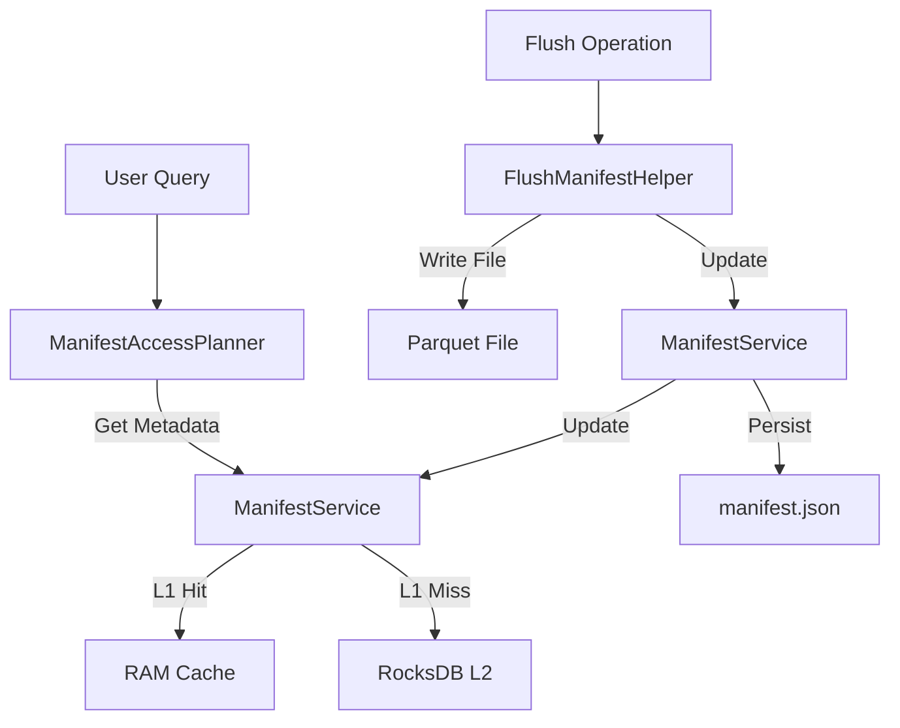

# Manifest Architecture & Lifecycle

## Overview

The Manifest system is the central nervous system of KalamDB's storage engine. It tracks the location, lifecycle, and statistics of all data segments (Parquet files) for every table. It serves two critical purposes:
1.  **Durability**: It is the single source of truth for what data exists in the system.
2.  **Optimization**: It enables **Data Skipping** (Pruning) during queries, drastically reducing I/O.

## Core Data Structures

### 1. The Manifest
A `Manifest` is a metadata object associated with a specific table scope (Namespace + Table + User/Shared).
- **Version**: Monotonically increasing version number (optimistic concurrency).
- **Segments**: A list of `SegmentMetadata` objects representing immutable data files.
- **Sequence Number**: The highest assigned `_seq` number, ensuring global ordering.

### 2. Segment Metadata
Each immutable Parquet file is represented by a `SegmentMetadata` object:
- **Path**: Relative path to the file (e.g., `batch-42.parquet`).
- **MVCC Range**: `min_seq` and `max_seq` for version control.
- **Column Statistics**: A map of `ColumnStats` (Min/Max/NullCount) for the primary key and indexed columns.
    - *Example*: If a segment has `age` range `[20, 30]`, a query for `WHERE age > 50` will skip this file entirely without opening it.

## Architecture: Hot vs. Cold Storage

KalamDB employs a tiered architecture to balance fast lookup with long-term durability. Manifest
resolution is centralized in `ManifestService`; callers should not read `manifest.json` directly.

### Hot Store (Metadata Cache)
*   **Purpose**: Instant access for query planning and active write coordination.
*   **Implementation**:
    *   **L1 Cache (RAM)**: `DashMap` in `ManifestService` for shared-scope manifests. User-scoped manifests intentionally skip RAM so millions of active users do not allocate one in-process manifest each.
    *   **L2 Cache (RocksDB)**: Persisted Key-Value store (`kalamdb-store`). It is the hot manifest layer for user-scoped manifests and allows fast server restarts without parsing thousands of JSON files.
*   **Characteristics**: Volatile (L1) or local-persistent (L2). RocksDB acts as the local persistent manifest index.

### Cold Store (Durability Layer)
*   **Purpose**: Long-term archival, portability, and disaster recovery.
*   **Implementation**: `manifest.json` file stored alongside Parquet files.
*   **Format**: Human-readable JSON.
*   **Location**: Local Filesystem or Object Storage (S3).
*   **Characteristics**: Portable cold-storage metadata copy. Updated through `ManifestService` and the filestore layer.

### Lookup Order

`ManifestService::get_or_load()` is the single read-through manifest API. Shared-scope manifests
use all three layers:

```text
memory cache -> RocksDB manifest copy -> storage manifest.json
```

User-scoped manifests intentionally skip process memory and use RocksDB as their hot cache layer:

```text
RocksDB manifest copy -> storage manifest.json
```

If RocksDB has a shared-scope manifest, `ManifestService` hydrates memory before returning. If
storage `manifest.json` has the manifest, `ManifestService` hydrates RocksDB and hydrates memory
only for shared scopes. Ordinary shared-scope manifest mutations stay in memory + RocksDB; ordinary
user-scope manifest mutations stay in RocksDB. Both mark the entry dirty. Explicit
`persist_manifest()` / `flush_manifest()` calls write cold `manifest.json` after the corresponding
flush or metadata commit is ready, then refresh RocksDB and, for shared scopes, memory as in-sync.

## The Workflow

### 1. Ingestion (Write Path)
*   Incoming rows are written to the **WAL** and **MemTable** (RocksDB).
*   The Manifest is **NOT** updated for individual row inserts to prevent lock contention.
*   Data remains "in-flight" until a flush occurs.

### 2. Flush Operation (Commit)
When the MemTable fills up or a checkpoint is triggered:
1.  **Resolve Versions**: Hot rows are scanned in bounded batches and reduced to the latest `_seq` per primary key. User tables process one user scope at a time because hot keys are ordered by `(user_id, seq)`; shared tables resolve the shared scope as a whole to preserve the `_seq` fallback for rows with missing/null primary keys.
2.  **Write Parquet**: The common flush scope writer writes the resolved rows to a temp `batch-N.parquet.tmp` Parquet file for either a shared scope or `Some(user_id)` scope.
3.  **Compute Stats**: `FlushManifestHelper` calculates min/max values for the primary key, `_seq`, and indexed columns before the batch is moved into the Parquet writer.
4.  **Commit File + Manifest**: The temp file is renamed to `batch-N.parquet`, then a new `SegmentMetadata` entry is committed through the `ManifestService`, which writes cold `manifest.json`, persists the RocksDB copy, and refreshes shared-scope memory when applicable.
5.  **Clean Hot Store**: Flushed hot keys are removed in bounded indexed-store delete batches so cleanup does not build unbounded RocksDB operation vectors.

### 3. Query Execution (Read Path)
1.  **Plan**: The `ManifestAccessPlanner` requests the Manifest through `ManifestService`.
2.  **Prune**: The planner evaluates the query predicates (e.g., `WHERE region = 'US-East'`) against the `column_stats` of each segment.
    *   *Result*: A list of only the relevant files is returned.
3.  **Scan**: DataFusion opens and reads only the pruned list of Parquet files.

### 4. Recovery & Startup
*   **Fast Path**: On startup, `ManifestService` loads metadata directly from **RocksDB (L2)** and hydrates shared-scope memory on demand.
*   **Slow Path (Cold Start)**: If RocksDB is empty (fresh node), the system reads `manifest.json` from the storage backend.
*   **Disaster Recovery**: If `manifest.json` is missing or corrupted, the `ManifestService` can scan the directory for `*.parquet` files and **rebuild** the manifest by reading the footers of every file.

## Component Interaction



## Key Components

| Component | Role | Location |
|-----------|------|----------|
| `ManifestService` | The authoritative manager. Handles coordination between Hot and Cold stores. | `kalamdb-core/src/manifest/service.rs` |
| `FlushManifestHelper` | Computes statistics during flush and commits changes. | `kalamdb-core/src/manifest/flush_helper.rs` |
| `SegmentMetadata` | Data structure holding stats and paths. | `kalamdb-commons/src/models/types/manifest.rs` |
