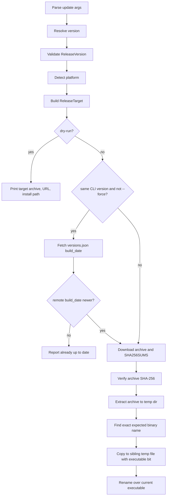

# Release Download and Update Architecture

## Overview

KalamDB has three release download paths:

- `install.sh`: first-time CLI installation from GitHub release assets.
- `kalam update`: self-update of the currently running CLI binary.
- `kalam dev`: managed local `kalamdb-server` download when a colocated, configured, or PATH
  server binary is not available.

All three paths install binaries from versioned GitHub release assets and verify the downloaded
archive against `SHA256SUMS` before installing anything. The Rust paths share release targeting,
version validation, checksum parsing, archive extraction, and extracted-file lookup helpers in the
CLI crate.

The current trust model verifies asset integrity against release checksums fetched over HTTPS. It
does not yet verify a publisher signature over `SHA256SUMS` or the release assets. A compromised
GitHub release, token, or release workflow that can replace both an archive and `SHA256SUMS` is
therefore still in scope until signed release metadata is added.

## Release artifact contract

The release workflow publishes platform-specific CLI and server archives with deterministic names:

```text
kalamcli-<version>-<platform>.tar.gz
kalamcli-<version>-<platform>.zip
kalamdb-server-<version>-<platform>.tar.gz
kalamdb-server-<version>-<platform>.zip
SHA256SUMS
versions.json
```

`<platform>` is one of the supported OS/architecture pairs, such as `linux-x86_64`,
`linux-aarch64`, `macos-aarch64`, or `windows-x86_64`.

The binary inside a CLI archive is expected to have the exact release binary name:

```text
kalamcli-<version>-<platform>
kalamcli-<version>-<platform>.exe
```

Windows `.zip` archives also include the Microsoft VC++ runtime DLLs required to run the
MSVC-built server and CLI binaries on machines without the Visual C++ Redistributable
installed. At minimum the archive contains:

```text
msvcp140.dll
vcruntime140.dll
vcruntime140_1.dll
```

Keep the `.exe` and bundled `.dll` files in the same directory when extracting manually.

The installer and self-updater install that payload as `kalam` at the final install path. They do
not install arbitrary executable files found in the archive.

## Shared Rust release modules

The Rust CLI uses two small release-domain modules to keep update behavior centralized.

### `ReleaseVersion`

`cli/src/release_version.rs` owns release version parsing and validation.

Accepted versions are normalized by trimming whitespace and a single leading `v`, then validated as:

```text
major.minor.patch[-prerelease[.prerelease...]]
```

The parser rejects:

- empty versions
- path separators and whitespace
- URL-shaped values
- build metadata (`+...`) because release artifact names do not use it
- numeric core parts with leading zeroes
- prerelease identifiers outside ASCII letters, digits, and hyphens

This keeps command-line values, GitHub tag values, and release URL construction from accepting
path-like or control-character input.

### `ReleaseTarget`

`cli/src/release_target.rs` owns the interface for a concrete release payload:

- artifact prefix (`kalamcli` for the CLI)
- validated `ReleaseVersion`
- platform
- archive kind
- archive name
- expected binary name
- archive URL
- checksum URL
- optional manifest URL
- exact extracted-binary lookup

`kalam update` builds one `ReleaseTarget` and passes it through the rest of the flow. Callers do not
reconstruct archive names or search for loose binary candidates.

### `release_download`

`cli/src/release_download.rs` contains shared download and extraction primitives:

- platform detection
- archive naming helpers
- GitHub release base URL construction
- release-base environment override validation
- archive download
- text download
- SHA-256 verification
- tar/zip extraction
- symlink-safe extracted-file search
- executable-bit preserving copy

Release-base environment overrides are accepted only for localhost or loopback hosts. This keeps
test fixtures and local development possible without allowing production update behavior to be
redirected to an arbitrary remote host through the environment.

`SHA256SUMS` parsing is exact:

- the filename must match the expected archive name
- standard and binary checksum formats are accepted (`hash  file` and `hash *file`)
- the hash must be exactly 64 hexadecimal characters
- additional fields on the line are rejected

## `kalam update` flow

`kalam update` lives in `cli/src/commands/update.rs`.



The same-version path uses `versions.json` build metadata instead of executing a downloaded binary
just to inspect its build date. This avoids running untrusted payload code before checksum
verification and extraction for installation.

The update command verifies the archive before extraction and again before installation. The second
verification is intentionally cheap and keeps the install branch protected if future changes alter
the pre-install flow.

Replacement is local and atomic where the platform supports atomic rename:

1. Copy the verified extracted binary to a staging path beside the install target (Unix) or in the update temp directory (Windows).
2. Mark it executable on Unix.
3. Replace the current executable:
   - Unix: rename the staging file over the current executable.
   - Windows: spawn a detached PowerShell helper that waits for the running PID to exit, then moves the staged binary over the install path with retries (the running `.exe` is locked).
4. Remove temporary extraction files after installation completes (the Windows helper removes its temp directory after the move).

## `install.sh` flow

`install.sh` is the bootstrap path for users that do not already have the CLI. It cannot reuse Rust
code directly, so it mirrors the same security rules in shell:

1. Re-exec under Bash when invoked through `sh`.
2. Parse `--version`, `--pre-release`, and environment settings.
3. Detect platform.
4. Require `curl`, archive tooling, and `sha256sum` or `shasum`.
5. Resolve a requested or latest GitHub version.
6. Validate the version string before URL or filename construction.
7. Download the exact archive.
8. Download `SHA256SUMS`; absence is a hard failure.
9. Find the exact archive entry in `SHA256SUMS`.
10. Require a valid 64-character SHA-256 hash.
11. Verify the archive bytes.
12. Reject archive entries with absolute paths or `..` traversal.
13. Extract the archive.
14. Find only the exact expected binary name.
15. Copy it to a temporary install file, set mode `0755`, and rename it to `kalam`.

The installer does not fall back to "any executable in the archive" and does not skip checksum
verification when checksums are unavailable.

## Managed local server download

`kalam dev` can run with a managed local `kalamdb-server` binary. The logic lives in
`cli/src/workflow/dev/server.rs`.

Server binary resolution is ordered:

1. `KALAMDB_SERVER_BIN`, if explicitly configured and pointing to a file.
2. A `kalamdb-server` binary colocated with the running CLI.
3. The managed binary under the Kalam config directory.
4. `kalamdb-server` on `PATH`.

If no server binary is found, interactive `kalam dev` prompts the user before downloading the
managed server. Non-interactive runs fail with guidance instead of downloading silently.

If the managed server exists but its version is stale relative to the CLI package version, the dev
workflow refreshes it. Interactive runs prompt; non-interactive runs may refresh as part of the
precheck path.

Managed server downloads use the same `release_download` helpers as CLI updates:

- `detect_platform()`
- `archive_name("kalamdb-server", version, platform, archive_kind)`
- `release_base_url(version, "KALAMDB_SERVER_RELEASE_BASE_URL")`
- `download_bytes()`
- `download_text()` for `SHA256SUMS`
- `verify_checksum()`
- `extract_archive()`
- symlink-safe file discovery
- executable-bit preserving copy

The server install path copies the primary `kalamdb-server` payload to the managed binary path and
copies supporting files, such as Windows runtime DLLs, into the same managed install directory.

Because `KALAMDB_SERVER_RELEASE_BASE_URL` uses the shared release base URL helper, it follows the
same localhost-only override rule as CLI updates.

## Security properties

The current implementation provides these guarantees:

- user-provided versions cannot inject paths, whitespace, URLs, or unsupported metadata into release
  filenames or URLs
- release download URL construction is centralized in Rust update flows
- release environment URL overrides cannot point to arbitrary remote hosts
- `SHA256SUMS` is mandatory for `install.sh`, `kalam update`, and managed server downloads
- checksum entries must match the exact expected archive name
- checksum hashes must be structurally valid SHA-256 hex
- downloaded archives are verified before extraction
- extracted CLI binaries must match the exact expected release binary name
- symlinked directories are not followed during Rust extracted-file discovery
- the shell installer rejects archive path traversal before extraction
- installs write to a temporary file before replacing the final binary

## Known limitations and next step

Checksums alone prove that the downloaded archive matches the downloaded checksum file. They do not
prove that the checksum file was produced by the KalamDB release publisher.

The next security step is to sign release metadata and verify it before trusting `SHA256SUMS`.
Acceptable approaches include:

- publish `SHA256SUMS.sig` and verify it with a pinned public key in `install.sh` and Rust update
  paths
- publish Sigstore/cosign signatures and verify identity and certificate constraints
- embed a TUF-style root and verify signed release metadata before selecting assets

Until one of those is implemented, the update system is protected against network corruption,
accidental asset mismatch, path injection, checksum omission, broad archive payload selection, and
local override misuse, but not against a release-channel compromise that can replace both the asset
and checksum file.
